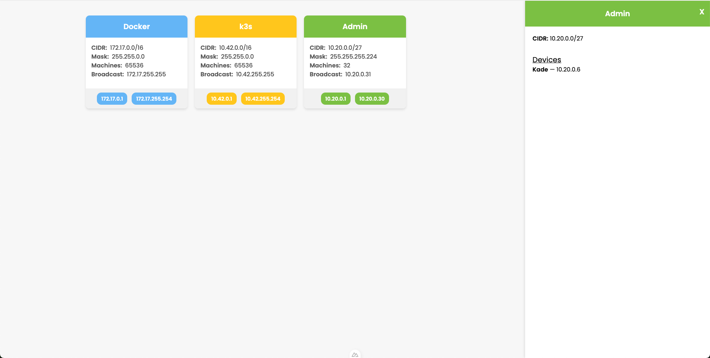

# network-inventory



## How to use the project (only locally for the moment!)

- Firstly, start project with `pnpm watch` (`pnpm install` is required for the first time).
- In `server/api/index.ts`, fill data with your own. It should respect Network interface.
- You can create a file name `local.json` at the root of the project.

[CIDR.xyz](https://cidr.xyz/) is a very good tool to compute networks.
```ts
type Network = {
  name: string;
  cidr: string; // "10.10.10.10/16" — https://cidr.xyz
  color: string;
  devices?: Array<{ name: string; ip: string }>;
};
```
